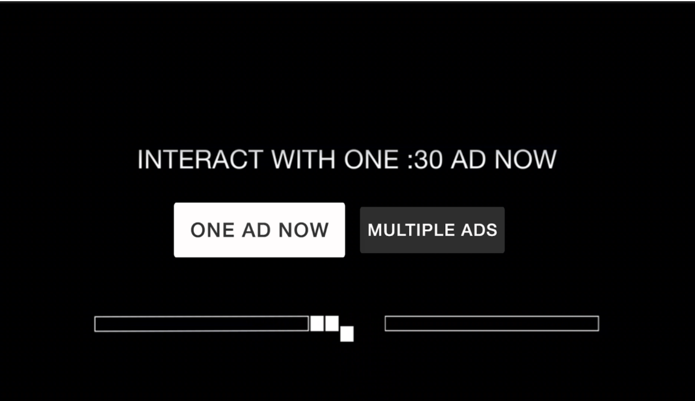

# TruexAdRenderer Android/Fire TV Documentation

Version 1.0.0

## Contents

* [Overview](#overview)
* [Product Flows](#product-flows)
* [How to use TruexAdRenderer](#how-to-use-truexadrenderer)
    * [When to show True\[X\]](#when-to-show-truex)
    * [Handling Events from TruexAdRenderer](#handling-events-from-truexadrenderer)
    * [Handling Ad Elimination](#handling-ad-elimination)
* [TruexAdRenderer Android/Fire TV API](#truexadrenderer-androidfire-tv-api)
    * [`TruexAdRenderer` Methods](#truexadrenderer-methods)
        * [`init`](#init)
        * [`start`](#start)
        * [`stop`](#stop)
        * [`pause`](#pause)
        * [`resume`](#resume)
    * [`TruexAdRenderer` Output Events](#truexadrenderer-output-events)
        * [`AD_STARTED`](#ad_started)
        * [`AD_COMPLETED`](#ad_completed)
        * [`AD_ERROR`](#ad_error)
        * [`NO_ADS_AVAILABLE`](#no_ads_available)
        * [`AD_FREE_POD`](#ad_free_pod)
        * [`POPUP_WEBSITE`](#popup_website)
        * [`OPT_IN` *(optional)*](#opt_in-optional)
        * [`OPT_OUT` *(optional)*](#opt_out-optional) 
        * [`SKIP_CARD_SHOWN` *(optional)*](#skip_card_shown-optional) 
        * [`USER_CANCEL` *(optional)*](#user_cancel-optional) 
        * [`USER_CANCEL_STREAM` *(optional)*](#user_cancel_stream-optional) 
    * [TruexAdRenderer Constants](#truexadrenderer-constants)
        * [`PREROLL`](#preroll)
        * [`MIDROLL`](#midroll)

## Overview

In order to support interactive ads on Android TV and Fire TV, TrueX has created a renderer library that can renderer TrueX ads natively, which interfaces with a hosting app, as well as its existing ad server and content delivery mechanism (e.g. SSAI).

With this library, the host player app can defer to the TruexAdRenderer when it is required to display a TrueX ad.

For simplicity, publisher implemented code will be referred to as "app code" while TrueX implemented code will be referred to as "renderer code".

TrueX will provide a Java `TruexAdRenderer` library that can be loaded into the app. This library will offer a class, `TruexAdRenderer`, that will need to be instantiated, initialized and given certain commands (described below in [TruexAdRenderer Methods](#truexadrenderer-methods)) by the app code. It will also contain a class of shared constants, `TruexAdRendererConstants`.

At this point, the renderer code will take on the responsibility of requesting ads from TrueX server, creating the native UI for the TrueX choice card and interactive ad unit, as well as communicating events to the app code when action is required.

The app code will still need to parse out the SSAI ad response, detect when a TrueX ad is supposed to display, pause the stream, instantiate `TruexAdRenderer` and handle any events emitted by the renderer code. It will also need to call pause, resume and stop methods on the `TruexAdRenderer` when certain external events happen, like if the app is backgrounded or if the user has requested to exit the requested stream via back buttons.

It will also need to handle skipping ads in the current ad pod, if it is notified to do so.

## Product Flows

There are two distinct product flows supported by `TruexAdRenderer`: Sponsored Stream (full-stream ad-replacement) and Sponsored Ad Break (mid-roll ad-replacement).

In a Sponsored Ad Break flow, once the user hits a mid-roll break with a TrueX tag flighted, they will be shown a "choice-card" offering them the choice between watching a normal set of video ads or a fully interactive TrueX ad:

***Fig. A** example true\[X\] mid-roll choice card*

If the user opts for a normal ad break, or if the user does not make a selection before the 30 second countdown timer expires, the TrueX UI will close and playback of normal video ads can continue as usual.

If the user opts to interact with TrueX, an interactive ad unit will be shown to the user:

***Fig. B** example true\[X\] interactive ad unit*

The requirement for the user to "complete" this ad is for them to spend at least 30 seconds on the unit and for at least one interaction (navigating anywhere through the ad).

***Fig. C** example true\[X\] attention timer*

Once the user fulfills both requirements, a "Watch Your Show" button will appear in the bottom right, which the user can select to exit the TrueX ad. Having completed a TrueX ad, the user will be returned directly to content, skipping the remaining ads in the current ad pod.

The Sponsored Stream flow is quite similar. In this scenario, a user will be shown a choice-card in the preroll:

***Fig. D** example true\[X\] preroll choice card (full-stream replacement)*

Similarly, if the user opts-in and completes the TrueX ad, they will be skipped over the remainder of the pre-roll ad break. However, every subsequent mid-roll break in the current stream will also be skipped over. In this case instead of the regular pod of video ads, the user will be shown a "hero card" (also known as a "skip card"):

***Fig. E** example true\[X\] mid-roll skip card*

This messaging will be displayed to the user for several seconds, after which they will be returned directly to content.

## How to use TruexAdRenderer 

### When to show True\[X\]

Upon receiving an ad schedule from your SSAI service, you should be able to detect whether or not TrueX is returned in any of the pods. TrueX ads should have `apiFramework` set to `VPAID` or `truex`.

SSAI vendors differ in the way they convey information back about ad schedules to clients. Certain vendors such as Verizon / Uplynk expose API’s which return details about the ad schedule in a JSON object. For other vendors, for instance Google DAI, the TrueX payload will be encapsulated as part of a companion payload on the returned VAST ad. Please work with your TrueX point of contact if you have difficulty identifying the right approach to detecting the TrueX placeholder, which will be the trigger point for the ad experience.

Once the player reaches a TrueX placeholder, it should pause, instantiate the `TruexAdRenderer` and immediately call `init` followed by `start`.

Alternatively, you can instantiate and `init` the `TruexAdRenderer` in preparation for an upcoming placeholder. This will give the `TruexAdRenderer` more time to complete its initial ad request, and will help streamline TrueX load time and minimize wait time for your users. Once the player reaches a placeholder, it can then call `start` to notify the renderer that it can display the unit to the user.

### Handling Events from TruexAdRenderer

Once `start` has been called on the renderer, it will start to emit events (a full list of events is available in [TruexAdRenderer Output Events](#truexadrenderer-output-events)).

One of the first events you will receive is `AD_STARTED`. This notifies the app that the renderer has received an ad for the user and has started to show the unit to the user. The app does not need to do anything in response, however it can use this event to facilitate a timeout. If an `AD_STARTED` event has not fired within a certain amount of time, the app can call `stop` on the renderer and proceed to normal video ads. 

If there were no ads available to the user or if there was an error making the ad request, `NO_ADS_AVAILABLE` or `AD_ERROR` will fire respectively. At this point, the app should resume playback without skipping any ads, so the user receives a normal video ad payload.

Another important event to listen for is `AD_FREE_POD`. This signifies that the user has earned a credit with TrueX and, once the renderer signals it is complete (via the `AD_COMPLETED` event), all linear video ads remaining in the current pod should be skipped. It's important to note that the player should not immediately resume playback once receiving this event -- rather it should note that it was fired and continue to wait for an `AD_COMPLETED` event.

Another possible event emitted on exit by the TruexAdRenderer is `OPT_OUT`. This occurs when the user opts out of TrueX or when they let the choice card countdown expire. When this happens, playback still should resume, but without fast-forwarding so the user receives the remaining payload of video ads.

### Handling Ad Elimination

Skipping video ads is completely the responsibility of the app code. The SSAI API should provide enough information for the app to determine where the current pod end-point is, and the app, when appropriate, should fast-forward directly to this point when resuming playback.

## TruexAdRenderer Android/Fire TV API

This is an outline of public `TruexAdRenderer` methods and events. 

### TruexAdRenderer Methods

#### `init`

    public void init(String creativeURL, JSONObject adParameters, String slotType)

This method will be called by the app code in order to initialize the `TruexAdRenderer`. The renderer will parse out the `creativeURL`, `adParameters`, and `slotType` passed to it and make a request to the TrueX ad server to see what ads are available.

You may instantiate `TruexAdRenderer` early (a few seconds before the next pod even starts) in order to give it extra time to make the ad request.

The parameters for this method call are:

* `creativeURL`: TrueX asset url returned by SSAI. In the example of Uplynk, this would correspond to `response.ads.breaks[0].ads[0].creative`
* `adParameters`: AdParameters as returned by SSAI. In the example of Uplynk, this would correspond to `response.ads.breaks[0].ads[0].adParameters`
* `slotType`: the type of the current ad pod, `PREROLL` or `MIDROLL`

#### `start`

    public void start(final ViewGroup baseView)

This method will be called by the app code when the TrueX unit is ready to be displayed to the user. This can be called anytime after the unit is initialized. 

The app should have as much extraneous UI hidden as possible, including player controls, status bars and soft buttons/keyboards.

Once `start` is called, the renderer will wait for the ad request triggered in `init` to finish. 

If the request returns an ad, the renderer will immediately instantiate a `View` and present it on the `baseView`. Once this is complete, it will fire the `AD_STARTED` event. The user will be shown the TrueX choice card once all relevant assets have loaded. `OPT_IN`, `OPT_OUT` and `AD_FREE_POD` may fire after this point, depending on the user's choices. Then, either an `AD_COMPLETED`, `USER_CANCEL`, or `USER_CANCEL_STREAM` event will follow all other events at the end of a non-error flow. 

If the request returns no ads, the renderer will fire the `NO_ADS_AVAILABLE` event.

If the request signals that the user is in an ad-free state, then the renderer will immediately instantiate a `View` and present it on the `baseView`. Once this is complete, it will fire the `AD_STARTED` and `SKIP_CARD_SHOWN` events. After 3 seconds of a "skip card" being shown to the user, the `AD_FREE_POD` event will fire, followed immediately by the `AD_COMPLETED` event.

If the request fails, the renderer will fire the `AD_ERROR` event.

The parameters for this method call are:

* `baseView`: The `ViewGroup` that `TruexAdRenderer` should present its `View` to. The `baseView` should cover the entire screen.

#### `stop`

    public void stop()

The `stop` method is only called when the app needs the renderer to immediately stop and destroy all related resources.

For example, if a user backs out of the video stream to return to the normal app UI (perhaps by using a back button) or if there was an unrelated error that requires immediate halt of the current ad unit.

In contrast to `pause`, there is no way to resume the ad after `stop` is called.

#### `pause`

    public void pause()

`pause` is required whenever the renderer needs to pause the choice card or ad unit (including all video/audio and countdowns).

#### `resume`

    public void resume()

`resume` should be invoked when ad playback can resume

### `TruexAdRenderer` Output Events

#### `AD_STARTED`

    IEventHandler adStartedHandler = (Map<String, ?> data) -> {
        String campaignName = (String) data.get("campaignName");
        // [...]
    };
    truexAdRenderer.addEventListener(TruexAdRendererConstants.AD_STARTED, adStartedHandler);

This event will fire in response to the `start` method when the TrueX UI is ready and has been added to the view hierarchy.

The parameters for this event are:

* `campaignName`: The name of the ad campaign available to the user (e.g. "*US Air Force - Special OPS (TA M) - Q1 2017*")

#### `AD_COMPLETED`

    IEventHandler adCompletedHandler = (Map<String, ?> data) -> {
        int timeSpent = (Integer) data.get("timeSpent");
        // [...]
    };
    truexAdRenderer.addEventListener(TruexAdRendererConstants.AD_COMPLETED, adCompletedHandler);

This event will fire when the TrueX unit is complete -- at this point, the app should resume playback and remove all references to the `TruexAdRenderer` instance.

Here are some examples where `AD_COMPLETED` will fire:

* User opts for normal video ads (not TrueX)
* 15 second choice card countdown runs out
* User completes TrueX ad unit (or taps I'm done)
* After a "skip card" has been shown to a user for 3 seconds

The parameters for this event are:

* `timeSpent`: The amount of time (in seconds) the user spent on the TrueX interactive ad unit -- set to `0` if the user did not earn an ad free credit or if the user was shown a "skip card".

#### `AD_ERROR`

    IEventHandler adErrorHandler = (Map<String, ?> data) -> {
        String errorMessage = (String) data.get("errorMessage");
        // [...]
    };
    truexAdRenderer.addEventListener(TruexAdRendererConstants.AD_ERROR, adErrorHandler);

This event will fire when the TrueX unit has encountered an error it cannot recover from. The app code should handle this the same way as an `AD_COMPLETED` event -- resume playback and remove all references to the `TruexAdRenderer` instance.

#### `NO_ADS_AVAILABLE`

    IEventHandler noAdsAvailableHandler = (Map<String, ?> data) -> {
        // [...]
    };
    truexAdRenderer.addEventListener(TruexAdRendererConstants.NO_ADS_AVAILABLE, noAdsAvailableHandler);

This event will fire when the TrueX unit has determined it has no ads available to show the current user. The app code should handle this the same way as an `AD_COMPLETED` event -- resume playback and remove all references to the `TruexAdRenderer` instance.

#### `AD_FREE_POD`

    IEventHandler adFreePodHandler = (Map<String, ?> data) -> {
        // [...]
    };
    truexAdRenderer.addEventListener(TruexAdRendererConstants.AD_FREE_POD, adFreePodHandler);

This event will fire when the all remaining ads in the current ad pod need to be skipped. The app code should notate that this event has fired, but should not take any further action until it receives an `AD_COMPLETED` or `AD_ERROR` event.

*All following events are used mostly for tracking purposes -- no action is generally required:*

#### `POPUP_WEBSITE`

    IEventHandler popupWebsiteHandler = (Map<String, ?> data) -> {
        String url = (String) data.get("url");
        // [...]
    };
    truexAdRenderer.addEventListener(TruexAdRendererConstants.POPUP_WEBSITE, popupWebsiteHandler);

This event will fire when a popup webview is required from the app. The app should call `pause` on the renderer and display the requested URL to the user in a WebView with a close button. Once the user closes this view, the app should call `resume` on the renderer.

#### `OPT_IN` *(optional)*

    IEventHandler optInHandler = (Map<String, ?> data) -> {
        String campaignName = (String) data.get("campaignName");
        int adID = (Integer) data.get("adID");
        // [...]
    };
    truexAdRenderer.addEventListener(TruexAdRendererConstants.OPT_IN, optInHandler);

This event will fire if the user selects to interact with the TrueX interactive ad.

Note that this event may be fired multiple times if a user opts in to the TrueX interactive ad and subsequently backs out.

#### `OPT_OUT` *(optional)*

    IEventHandler optOutHandler = (Map<String, ?> data) -> {
        boolean userInitiated = (Boolean) data.get("userInitiated");
        // [...]
    };
    truexAdRenderer.addEventListener(TruexAdRendererConstants.OPT_OUT, optOutHandler);

This event will fire if the user opts for a normal video ad experience -- `userInitiated` will be set to `true` if this was actively selected by the user, `false` if the user simply allowed the choice card countdown to expire.

#### `SKIP_CARD_SHOWN` *(optional)*

    IEventHandler skipCardShownHandler = (Map<String, ?> data) -> {
        // [...]
    };
    truexAdRenderer.addEventListener(TruexAdRendererConstants.SKIP_CARD_SHOWN, skipCardShownHandler);

This event will fire anytime a "skip card" is shown to a user as a result of completing a TrueX Sponsored Stream interactive in an earlier preroll.

#### `USER_CANCEL` *(optional)*

    IEventHandler userCancelHandler = (Map<String, ?> data) -> {
        // [...]
    };
    truexAdRenderer.addEventListener(TruexAdRendererConstants.USER_CANCEL, userCancelHandler);

This event will fire when a user backs out of the TrueX interactive ad unit after having opted in. This would be achieved by tapping the "Yes" link to the "Are you sure you want to go back and choose a different ad experience" prompt inside the TrueX interactive ad. The user will be subsequently taken back to the Choice Card (with the countdown timer reset to full).

Note that after a `USER_CANCEL`, the user can opt-in and engage with an interactive ad again, so more `OPT_IN` or `OPT_OUT` events may then be fired.

#### `USER_CANCEL_STREAM` *(optional)*

    IEventHandler userCancelStreamHandler = (Map<String, ?> data) -> {
        int timeSpent = (Integer) data.get("timeSpent");
        // [...]
    };
    truexAdRenderer.addEventListener(TruexAdRendererConstants.USER_CANCEL_STREAM, userCancelStreamHandler);

This event conveys that a user has decided to cancel the stream entirely. The app, at this point, should treat this the same way it would handle any other "exit" action from within the stream -- in most cases this will result in the user being returned to an episode/series detail page.

#### `VIDEO_STARTED` *(optional)*

    IEventHandler videoStartedHandler = (Map<String, ?> data) -> {
        String videoName = (String) data.get("videoName");
        // [...]
    };
    truexAdRenderer.addEventListener(TruexAdRendererConstants.VIDEO_STARTED, videoStartedHandler);

This event is called whenever a video is started within an engagement.

#### `VIDEO_FIRST_QUARTILE` *(optional)*

    IEventHandler videoFirstQuartileHandler = (Map<String, ?> data) -> {
        String videoName = (String) data.get("videoName");
        // [...]
    };
    truexAdRenderer.addEventListener(TruexAdRendererConstants.VIDEO_FIRST_QUARTILE, videoFirstQuartileHandler);

This event is called whenever a video reaches the first quartile within an engagement.

#### `VIDEO_SECOND_QUARTILE` *(optional)*

    IEventHandler videoSecondQuartileHandler = (Map<String, ?> data) -> {
        String videoName = (String) data.get("videoName");
        // [...]
    };
    truexAdRenderer.addEventListener(TruexAdRendererConstants.VIDEO_SECOND_QUARTILE, videoSecondQuartileHandler);

This event is called whenever a video reaches the second quartile within an engagement.

#### `VIDEO_THIRD_QUARTILE` *(optional)*

    IEventHandler videoThirdQuartileHandler = (Map<String, ?> data) -> {
        String videoName = (String) data.get("videoName");
        // [...]
    };
    truexAdRenderer.addEventListener(TruexAdRendererConstants.VIDEO_THIRD_QUARTILE, videoThirdQuartileHandler);

This event is called whenever a video reaches the third quartile within an engagement.

#### `VIDEO_COMPLETED` *(optional)*

    IEventHandler videoCompletedHandler = (Map<String, ?> data) -> {
        String videoName = (String) data.get("videoName");
        // [...]
    };
    truexAdRenderer.addEventListener(TruexAdRendererConstants.VIDEO_COMPLETED, videoCompletedHandler);

This event is called whenever a video reaches completion within an engagement.

### TruexAdRenderer Constants

These constants will be available in `TruexAdRendererConstants`.

#### `PREROLL`

This value is used to pass into the `init` call, for the `slotType` parameter.

#### `MIDROLL`

This value is used to pass into the `init` call, for the `slotType` parameter.
